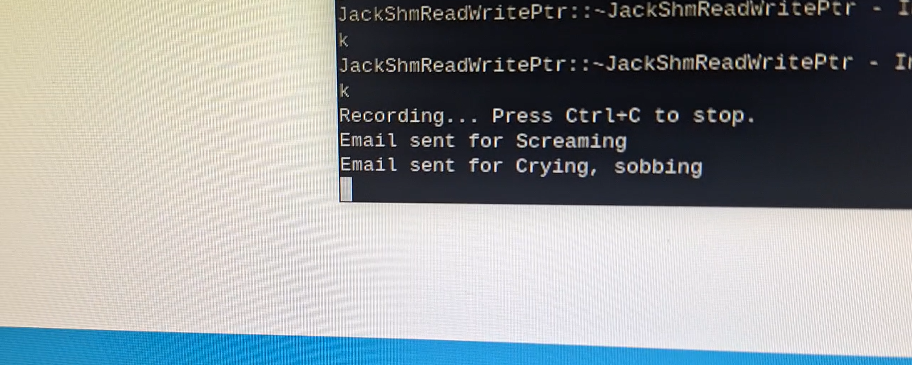
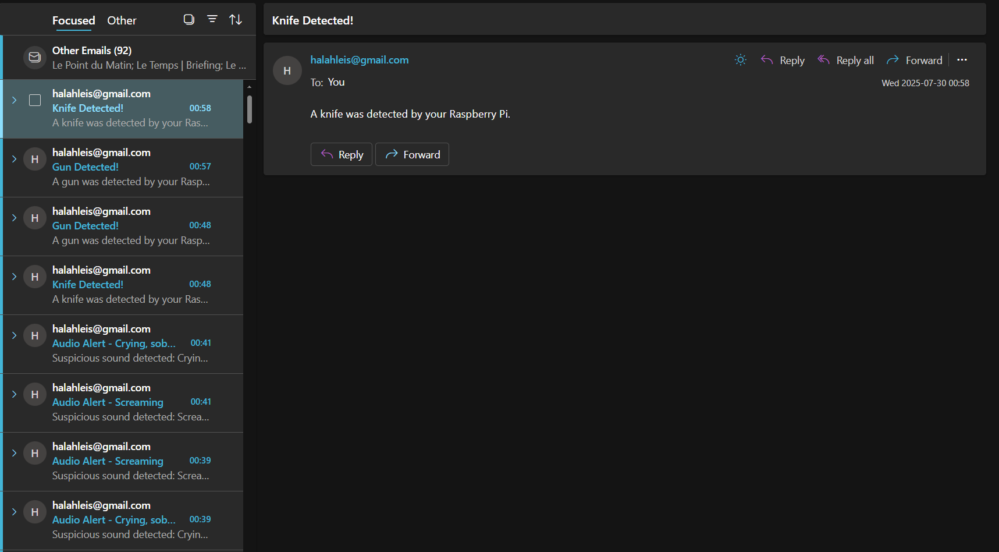

# Raspberry Pi AI Security System

This project consists of an AI-powered real-time security system using YOLOv5 and YAMNet on Raspberry Pi 5, capable of:

- Detecting **guns and knives** using a custom-trained YOLOv8 model
- Detecting **suspicious sounds** (screaming, crying, gunshot, etc.) using Google's YAMNet model
- Sending **email alerts**
- Activating a **warning LED**
- Playing a **siren alarm sound**
- Logging events locally

---

## How It Works

| Component            | Description |
|----------------------|-------------|
| `image_detect.py`    | Uses YOLOv8 for weapon detection via usb camera |
| `audio_detect.py`    | Uses YAMNet for screaming/gunshot detection via mic |
| GPIO (LED + sound)   | Alerts via LED and alarm speaker |
| Gmail API            | Sends email when a weapon or suspicious sound is detected |
| Log Files            | Events are recorded locally for traceability |

---

## Hardware Setup

- Raspberry Pi 5
- Monitor
- Keyboard + Mouse
- USB Webcam (for YOLOv8 detection)
- USB Microphone (for YAMNet audio classification)
- Speakers
- LED + 470 Ohm Resistor (on GPIO pin 18)
- Breadboard + Wires


🎥 [Demo Setup Video](media/setup_video.mp4)

---

## Project Structure

```text
AI-security-system/
├── yolov8_image_classification/
│ ├── image_detect.py
│ └── best.pt
│
├── yamnet_audio_classification/
│ ├── audio_detect.py
│ └── yamnet_model/
│
├── assets/
│ └── alarm.WAV
│
├── media/
│ ├── setup.jpg
│ ├── setup_video.mp4
│ ├── knife_gun_detection.mp4
│ ├── demo_with_led.mp4
| ├── scream_detection.mp4
│ ├── emails_sent_terminal_output.png
│ ├── emails_sent_screenshot.png
│ └── funny_demo.mp4
│
├── .env.example
├── requirements.txt
└── README.md
```
---

## Installation

1. **Clone the repository**

```bash
git clone https://github.com/halahleis/AI-security-system.git
cd AI-security-system
```

2. **Create and activate a virtual environment**
```bash
python3 -m venv venv
source venv/bin/activate  # On Windows: venv\Scripts\activate
```

3. **Install dependencies**
```bash
pip install -r requirements.txt
```
---

## Environment Variables
Create a .env file in the root of your project with:
```env
GMAIL_USER=your_email@gmail.com
GMAIL_APP_PASSWORD=your_app_password
```
Note: To get an app password 👉 [How to create a Gmail App Password](https://support.google.com/accounts/answer/185833?hl=en)

---

## Running the System
### Weapon Detection via Camera (YOLOv8)
```bash
cd yolov8_image_classification
python image_detect.py
```
- Displays annotated detection frame
- Triggers alarm + LED + email when knife or gun is detected
- Logs detections to `image_detection_log.txt`

### Suspicious Sound Detection (YAMNet)
```bash
cd yamnet_audio_classification
python audio_detect.py
```
- Plots real-time confidence of top 5 sound classes
- Triggers alarm + LED + email when suspicious sounds are detected ("crying, sobbing", "screaming", "shout", "gunshot", "explosion")
- Logs detections to `audio_detection_log.txt`

---

## Email Alert

### Terminal Output:
  
  
### Emails Received:
  

---

## Event Logging
Both detection scripts log alerts to:

- `image_detection_log.txt`
- `audio_detection_log.txt`
  
Each log includes a timestamp and detected event.

---

## Customization
- To modify the audio classes that trigger alerts, edit these two sections in `audio_detect.py`:
```python
suspicious_keywords = ["crying, sobbing", "screaming", "shout", "gunshot", "explosion"]
```
```python
email_sent_flags = {
    "crying, sobbing": False,
    "screaming": False,
    "shout": False,
    "gunshot": False,
    "explosion": False
}
```
- The best.pt model was trained on a small custom dataset of around 700 images (after augmentation) for two classes: knife and gun.
  While sufficient for demonstration purposes, it is not robust for real-world deployment.
  For improved performance, consider training a yolo model on a larger, more diverse dataset.

--- 

## Bonus: Demo Videos

| Type                      | Demo                              |
| --------------------      | --------------------------------- |
| Knife/Gun Detection       | 🎥 [Watch](media/knife_gun_detection.mp4) |
| Knife/Gun Detection + LED | 🎥 [Watch](media/demo_with_led.mp4) |
| Scream Detection          | 🎥 [Watch](media/scream_detection.mp4) |
| Fun Demo                  | 🎥 [Watch](media/funny_demo.mp4) |

I particularly hope you enjoy the last demo as much as I did making it! 😊

---

## Credits

- YOLOv8 from [Ultralytics](https://github.com/ultralytics/ultralytics)
- YAMNet from [Google Research](https://github.com/tensorflow/models/tree/master/research/audioset/yamnet)

  Note: YAMNet model is loaded locally from the `yamnet_model/` directory and downloaded from https://www.kaggle.com/models/google/yamnet.
- Dataset labeling using [Roboflow](https://roboflow.com/)

---

## Author
Made with ❤️ by Hala Hleiss
