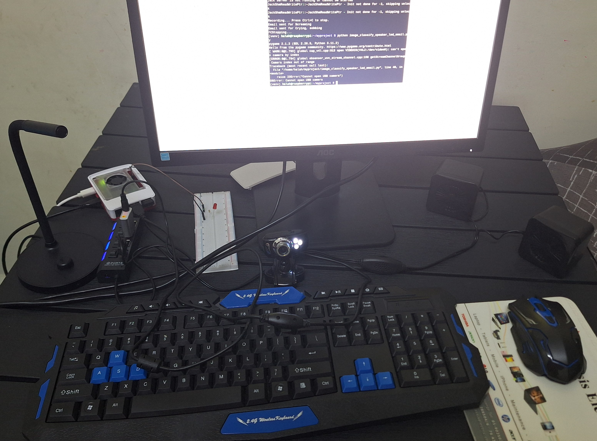

# 🛡️ Raspberry Pi AI Security System

AI-powered real-time security system using YOLOv5 and YAMNet on Raspberry Pi 5, capable of:

- 🎯 Detecting **guns and knives** using a custom-trained YOLOv8 model
- 🔊 Detecting **suspicious sounds** (screaming, crying, gunshot, etc.) using Google's YAMNet model
- 📩 Sending **email alerts**
- 💡 Activating a **warning LED**
- 🔊 Playing a **siren alarm sound**
- 🧠 Logging events locally

---

## 🧠 How It Works

| Component             | Description |
|----------------------|-------------|
| `image_detect.py`    | Uses YOLOv8 for weapon detection via camera |
| `audio_detect.py`    | Uses YAMNet for scream/gunshot detection via mic |
| GPIO (LED + sound)   | Alerts via LED and alarm speaker |
| Gmail API            | Sends email when a weapon or suspicious sound is detected |
| Log Files            | Events are recorded locally for traceability |

---

## 📸 Hardware Setup

- Raspberry Pi 5
- USB Webcam
- Microphone
- LED + Resistor (on GPIO pin 18)
- Speaker
- Breadboard + Wires



🎥 [Demo Setup Video](media/setup_video.mp4)

---

## 📁 Project Structure

AI-security-system/
├── yolov8_image_classification/
│ ├── image_detect.py
│ └── best.pt
│
├── yamnet_audio_classification/
│ ├── audio_detect.py
│ ├── yamnet_model/
│ └── yamnet_class_map.csv
│
├── assets/
│ └── alarm.WAV
│
├── media/
│ ├── setup.jpg
│ ├── setup_video.mp4
│ ├── demo_knife.mp4
│ ├── demo_scream.mp4
│ ├── terminal_output.png
│ ├── email_screenshot.png
│ └── funny_demo.mp4
│
├── .env.example
├── requirements.txt
└── README.md

yaml
Copy
Edit

---

## 🚀 Installation

1. **Clone the repository**

```bash
git clone https://github.com/your-username/AI-security-system.git
cd AI-security-system
Create and activate a virtual environment

bash
Copy
Edit
python3 -m venv venv
source venv/bin/activate  # On Windows: venv\Scripts\activate
Install dependencies

bash
Copy
Edit
pip install -r requirements.txt
🔐 Environment Variables
Create a .env file in the root of your project with:

env
Copy
Edit
GMAIL_USER=your_email@gmail.com
GMAIL_APP_PASSWORD=your_app_password
⚠️ This should never be committed to GitHub. It's already included in .gitignore.

To get an app password: How to create a Gmail App Password

🧪 Running the System
🎯 Weapon Detection via Camera (YOLOv8)
bash
Copy
Edit
cd yolov8_image_classification
python image_detect.py
Displays annotated detection frame

Triggers alarm + LED + email

Logs detections to image_detection_log.txt

🔊 Suspicious Sound Detection (YAMNet)
bash
Copy
Edit
cd yamnet_audio_classification
python audio_detect.py
Plots real-time confidence of top 5 sound classes

Triggers alarm + LED + email

Logs detections to audio_detection_log.txt

📬 Email Alert Demo


🧾 Event Logging
Both detection scripts log alerts to:

image_detection_log.txt

audio_detection_log.txt

Each log includes a timestamp and detected event.

🎉 Bonus: Demo Videos
Type	Demo
Knife/Gun Detection	🎥 Watch
Scream Detection	🎥 Watch
Fun Retro-Style Demo	🎥 Watch

⚠️ Notes
YAMNet model is loaded locally from the yamnet_model/ directory to avoid deprecation warnings from TensorFlow Hub.

The class labels are also loaded from a local copy of yamnet_class_map.csv.

📦 Dependencies
See requirements.txt. Key packages include:

ultralytics (YOLOv8)

tensorflow, tensorflow-hub (YAMNet)

pygame, RPi.GPIO

pyaudio, matplotlib

python-dotenv

👩‍💻 Author
Made with ❤️ by Hala Hleiss

📜 License
This project is for educational and demonstration purposes. Contact the author for reuse permissions.